# Banana

### 

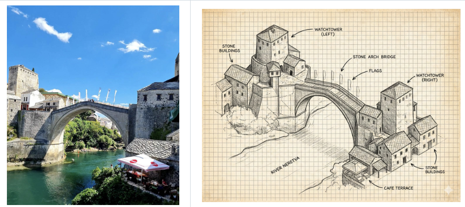

```
绘制这条街道的手绘等距示意图
```
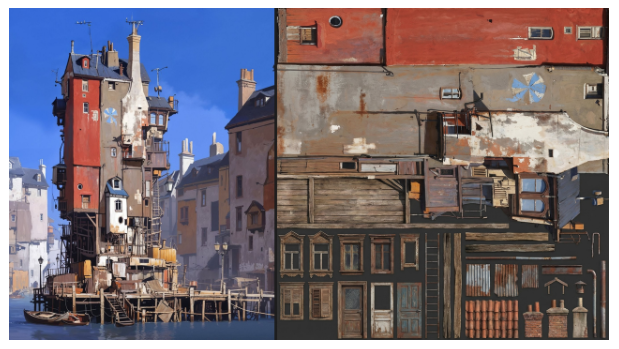
```
您能否帮我使用这座建筑的纹理生成一个装饰图集？
```
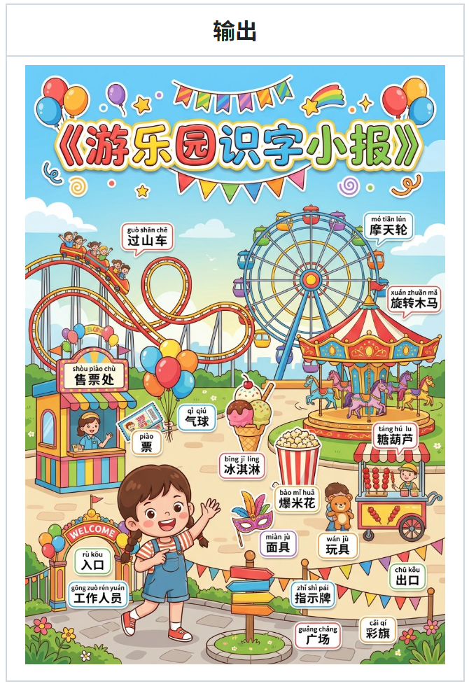
```
请生成一张儿童识字小报《游乐园》，竖版 A4，学习小报版式，适合 5–9 岁孩子 认字与看图识物。 一、小报标题区（顶部） 顶部居中大标题：《游乐园识字小报》 风格：十字小报 / 儿童学习报感 文本要求：大字、醒目、卡通手写体、彩色描边 装饰：周围添加与 游乐园 相关的贴纸风装饰，颜色鲜艳 二、小报主体（中间主画面） 画面中心是一幅 卡通插画风的「游乐园」场景： 整体气氛：明亮、温暖、积极 构图：物体边界清晰，方便对应文字，不要过于拥挤。 场景分区与核心内容 核心区域 A（主要对象）：表现 游乐园 的核心活动（孩子们在玩游乐设施）。 核心区域 B（配套设施）：展示相关的工具或物品（售票、零食、指示设施）。 核心区域 C（环境背景）：体现环境特征（入口、路牌、彩旗、绿地等）。 主题人物 角色：1 位可爱卡通人物（身份：游乐园工作人员/游客小朋友皆可）。 动作：正在进行与场景相关的自然互动（如微笑指路、挥手欢迎、陪孩子玩）。 三、必画物体与识字清单（Generated Content） 请务必在画面中清晰绘制以下物体，并为其预留贴标签的位置： 1. 核心角色与设施： gōng zuò rén yuán 工作人员 shòu piào chù 售票处 guò shān chē 过山车 mó tiān lún 摩天轮 xuán zhuǎn mǎ 旋转木马 2. 常见物品/工具： piào 票 qì qiú 气球 bīng jī líng 冰淇淋 bào mǐ huā 爆米花 táng hú lu 糖葫芦 miàn jù 面具 wán jù 玩具 xiǎo qí zi 小旗子 3. 环境与装饰： rù kǒu 入口 chū kǒu 出口 zhǐ shì pái 指示牌 cǎi qí 彩旗 guǎng chǎng 广场 (注意：画面中的物体数量不限于此，但以上列表必须作为重点描绘对象；总计 18 个典型名词，适合 5–9 岁儿童识字。) 四、识字标注规则 对上述清单中的物体，贴上中文识字标签： 格式：两行制（第一行拼音带声调，第二行简体汉字）。 样式：彩色小贴纸风格，白底黑字或深色字，清晰可读。 排版：标签靠近对应的物体，不遮挡主体。 五、画风参数 风格：儿童绘本风 + 识字小报风 色彩：高饱和、明快、温暖 (High Saturation, Warm Tone) 质量：8k resolution, high detail, vector illustration style, clean lines.
```
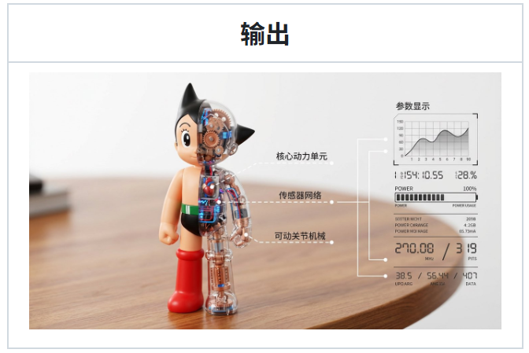
```
桌子上只有一个[阿童木]的玩具，玩具被对半分为左右两部分展示，玩具左半边是正常的玩具形象，右半边是透明的外壳，可以清晰的看到里面的内部构造，并有白色的线指出每一个部分是做什么的，在桌面上，明亮的背景，虚化的桌子。左边展示这个一半透明一半实体的玩具，画面的右边展示各类线条指出的参数指
```
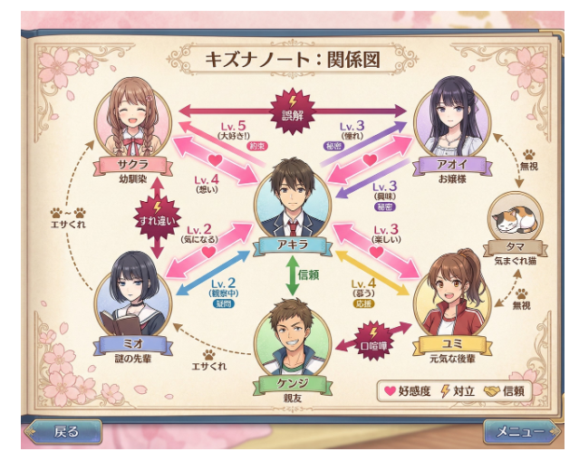
```
【日式恋爱模拟游戏】角色关系图。包含角色名称、关系箭头、好感度、冲突点。【剧情喜剧风格】。共7个角色。
```

```
为这张手办完成材质添加和上色，同时将周围环境变为符合角色设定的环境
```
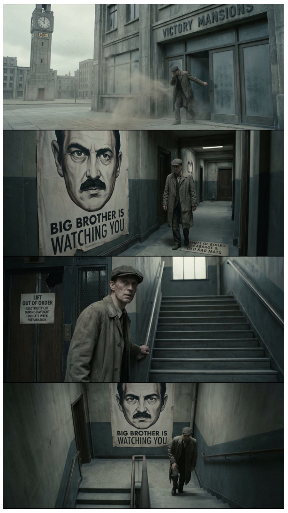
```
使用宽屏面板，为《1984》第一页创作电影分镜脚本。
```
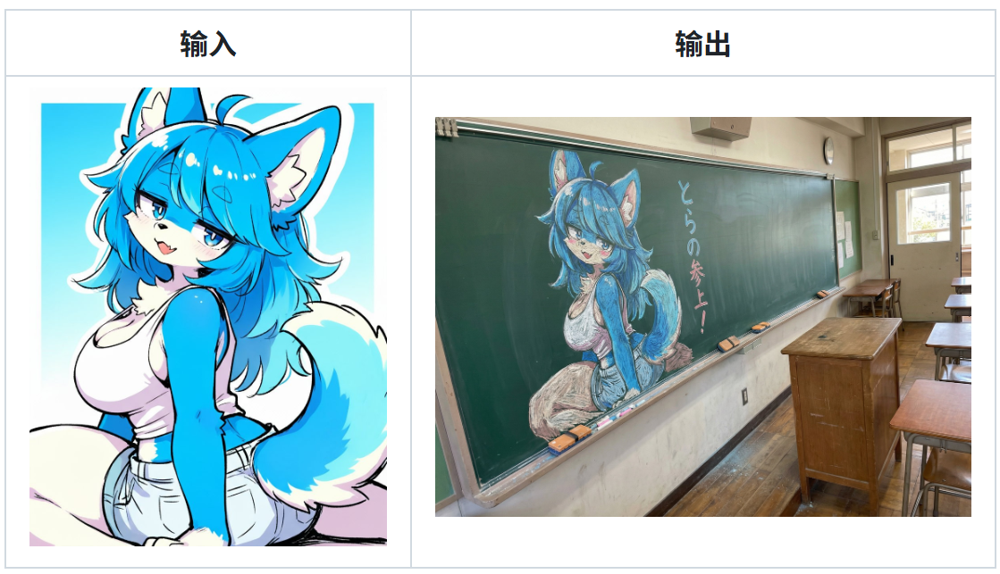
```
将这幅插图用粉笔在黑板上进行绘画，使用彩色粉笔，从某个角度拍摄了黑板，场景来自日本教室，黑板靠墙放置，老师的桌子在前面，插图旁边用粉笔写着“虎来了！”。
```
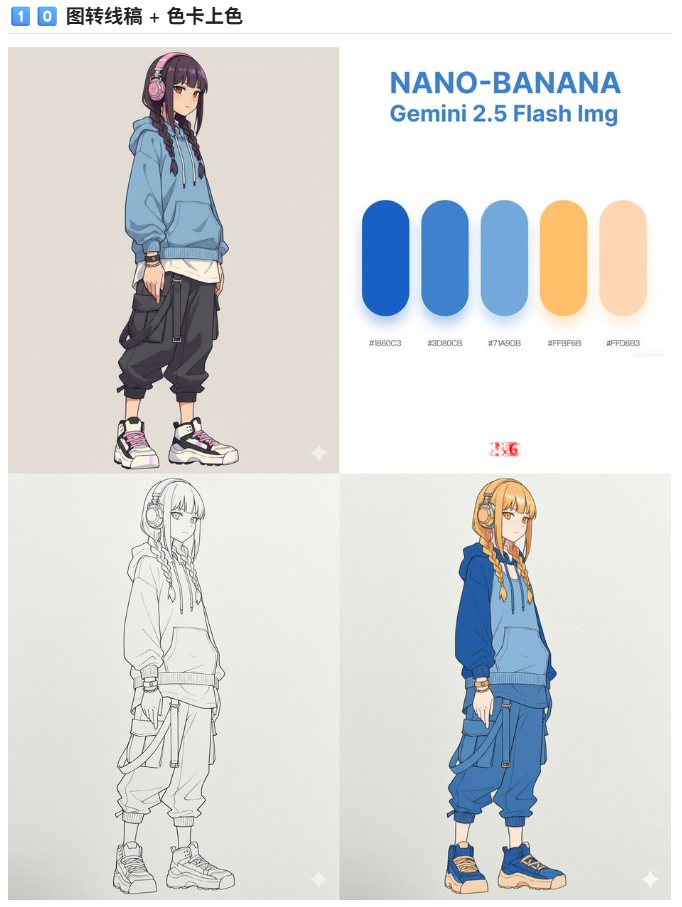
```
准确使用色卡为图二人物上色
```
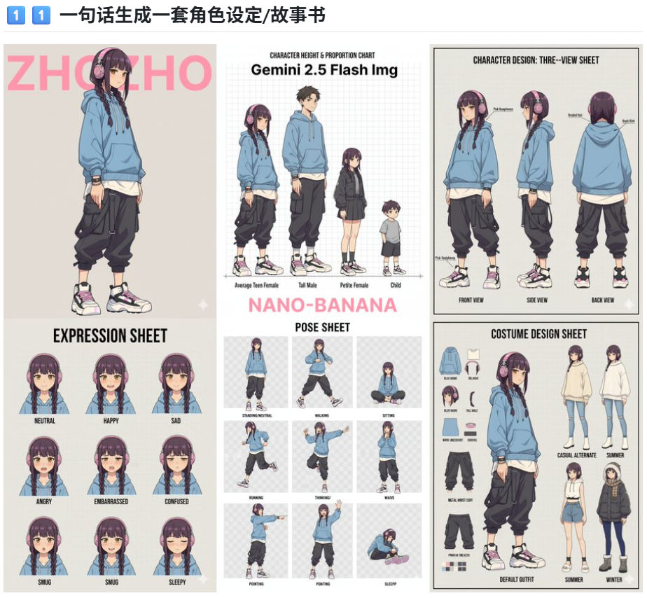
```
为我生成人物的角色设定（Character Design）

比例设定（不同身高对比、头身比等）

三视图（正面、侧面、背面）

表情设定（Expression Sheet） 

动作设定（Pose Sheet） → 各种常见姿势

服装设定（Costume Design）
```
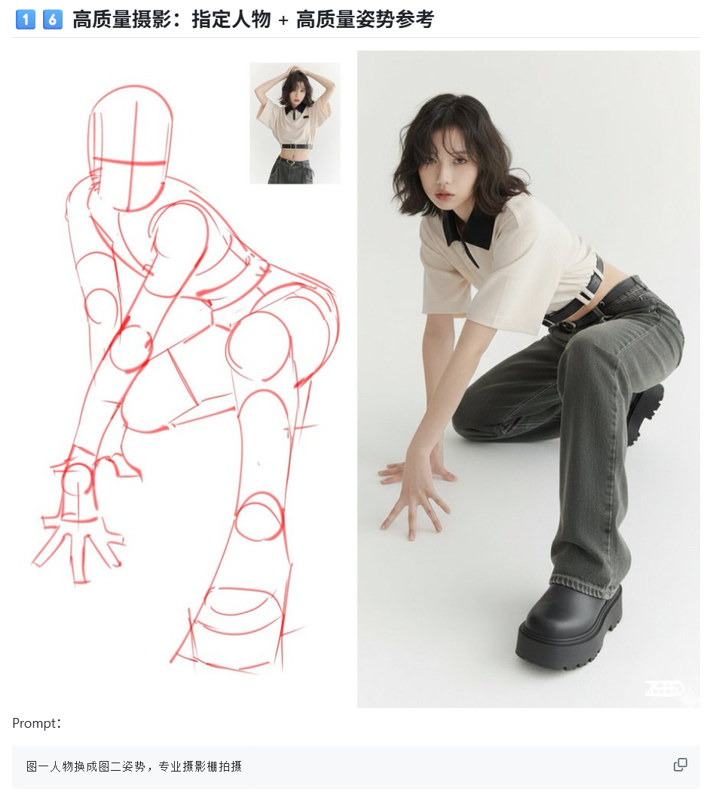
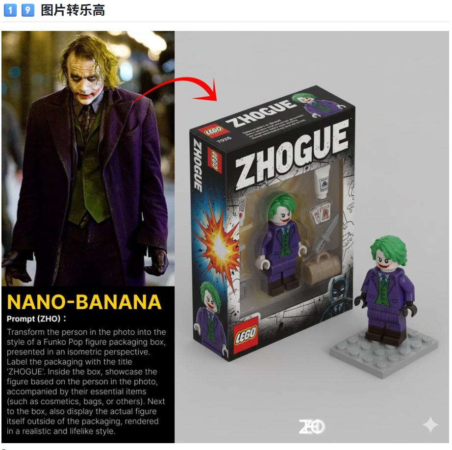
```
准确使用色卡为图二人物上色
```